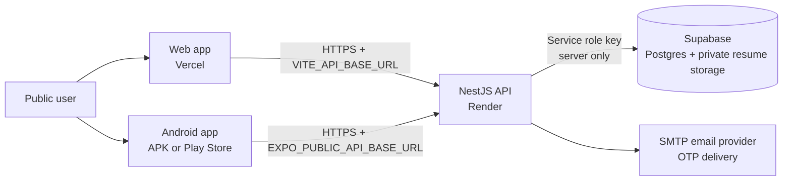
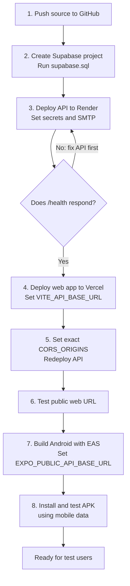
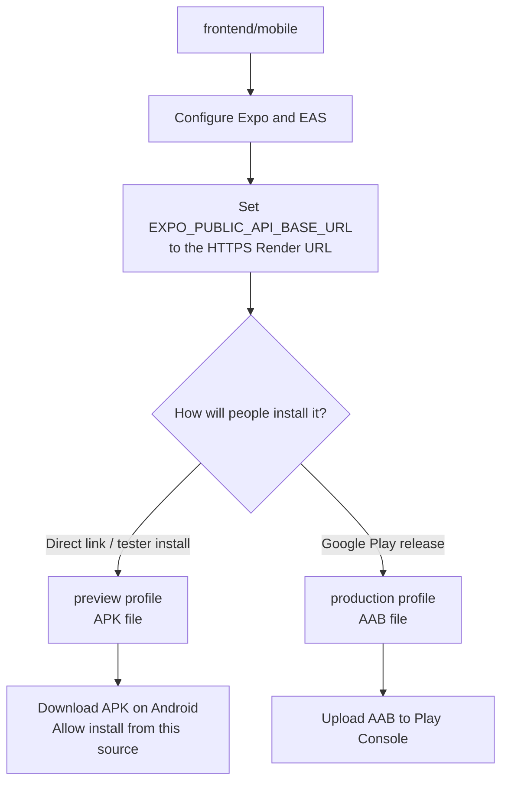

# Public Deployment and Android APK Guide

This project has three separately deployed pieces: the Supabase database and file storage, a NestJS API, and the web/mobile clients. The web and mobile apps must call the deployed API over HTTPS; neither app should connect directly to Supabase with the service-role key.

## At a glance



Follow the setup in this order. Each box is a checkpoint; do not move on until its check succeeds.



| Step | You should have | Check before continuing |
| --- | --- | --- |
| 1. GitHub | Repository connected to your hosting accounts | No `.env` files or secret keys in the repository |
| 2. Supabase | Tables, seed rows, and private resume bucket | SQL Editor reports the script completed |
| 3. Render | Public HTTPS API URL | Open `https://YOUR-API-URL/health` successfully |
| 4-6. Vercel | Public web URL connected to the API | Jobs load and the browser has no CORS errors |
| 7-8. Expo EAS | Installable Android APK | OTP and core actions work over mobile data |

**Security checkpoint:** the current demo authentication is not safe for real personal data. Deploy and test with disposable accounts only until the security gate below is resolved.

## Important security gate

Do not put real user data on a public deployment yet. The current API returns a hard-coded demo access token after OTP verification, does not validate that token on later requests, and accepts an email address from the caller for profile, resume, and application operations. A stranger who knows an email address could access or change that user's data. Before inviting real users, replace this with real session tokens and server-side authorization that derives the account identity from the verified session. Also add OTP attempt/rate limits and review the production email failure path. Until that work is complete, deploy only with test accounts and disposable data.

## 1. Prepare the repository

1. Create a GitHub repository and push this project to it. Do not commit `.env` files, Supabase keys, SMTP passwords, or provider API keys. The root `.gitignore` excludes `.env`; check the GitHub file list before proceeding.
2. Install a current Node.js LTS release locally. The hosting services below install dependencies from the committed `package-lock.json` files.
3. Choose and save these public URLs as you create services:
   - API: for example, `https://careernexus-api.onrender.com`
   - Web: for example, `https://careernexus.vercel.app`

The names above are examples. Use the actual URLs assigned to your accounts.

## 2. Create the Supabase database

1. Sign in at [Supabase](https://supabase.com/) and create a project. Pick the region closest to most users, set a strong database password, and keep it private.
2. In the project, open **SQL Editor**, create a query, paste the entire contents of `backend/api/supabase.sql`, and run it. This creates the app tables, seed data, and private resume storage bucket.
3. In **Project Settings → API** (or **API Keys** in the current dashboard), copy the project URL and the secret `service_role` key. The dashboard may label the key as a secret key. These are backend secrets: never put the service-role key in the web app, mobile app, GitHub, or a `VITE_` / `EXPO_PUBLIC_` variable.
4. Keep the Supabase project active. Free projects may pause when inactive; check the current plan limits and backup/retention terms before depending on it for production.

## 3. Deploy the API to Render

1. In Render, choose **New → Web Service**, connect the GitHub repository, and set **Root Directory** to `backend/api`.
2. Use these commands:
   - Build: `npm ci && npm run build`
   - Start: `npm run start`
3. Add environment variables in the Render service's **Environment** page. Add them one at a time; do not add quote marks around values unless they are part of the value:
   - `NODE_ENV` = `production`
   - `SUPABASE_URL` = the Supabase project URL
   - `SUPABASE_SERVICE_ROLE_KEY` = the secret service-role key
   - `EMAIL_PROVIDER` = `gmail` (or the provider configured below)
   - `SMTP_HOST` = `smtp.gmail.com`
   - `SMTP_PORT` = `587`
   - `SMTP_SECURE` = `false`
   - `SMTP_USER` = the email account used to send OTP messages
   - `SMTP_PASS` = that account's Google App Password, not its normal password
   - `SMTP_FROM` = the sender address
   - `CORS_ORIGINS` = temporarily `https://careernexus.vercel.app`; replace with your actual web URL in step 4
4. Do not set `PORT` unless the host specifically requires it; the API reads the host-provided `PORT` and binds to `0.0.0.0`.
5. Deploy. In the Render service's **Settings**, copy its public URL. Visit `https://YOUR-API-URL/health`; a healthy API returns a small JSON status response. If it fails, check Render's deploy logs and verify the environment variables.
6. Optional job-feed integrations can be configured with the `ADZUNA_*`, `JOOBLE_API_KEY`, `RAPIDAPI_KEY`, and ATS variables described in `backend/api/README.md`. The app can start without these; live job results from those providers will not be available.

For Gmail, enable two-step verification on the sending account and create an App Password in the Google Account security settings. If your email provider differs, use its SMTP host, port, TLS setting, username, and password instead. Test delivery before sharing the site.

## 4. Deploy the web app to Vercel

1. In Vercel, import the same GitHub repository.
2. Set **Root Directory** to `frontend/web`. Vercel should detect Vite; use build command `npm run build` and output directory `dist` if it asks.
3. Add the environment variable `VITE_API_BASE_URL` with the full API URL from Render, including `https://` and with no trailing slash. For example: `https://careernexus-api.onrender.com`.
4. Deploy and copy the public Vercel URL.
5. Return to Render and set `CORS_ORIGINS` to the exact web origin, such as `https://careernexus.vercel.app` (no path and no trailing slash). For multiple trusted web origins, separate them with commas. Save and redeploy the API.
6. Open the web URL and check that public job/course/library data loads. Test OTP only after SMTP is configured. Production builds now show an error if the API cannot be reached instead of silently pretending that local onboarding succeeded.

If you change `VITE_API_BASE_URL`, create a new Vercel deployment; Vite embeds this value at build time. The variable is public by design and must contain only the API URL, never credentials.

## 5. Build an installable Android APK with Expo EAS

An APK is suitable for direct installation and sharing. A Google Play release normally uses an Android App Bundle (`.aab`) instead.



For a first public test, use the direct APK path. Choose the Play Store path only when you are ready to create a Play Console listing and follow Google's release requirements.

1. The Expo project is under `frontend/mobile`. The Android application ID is currently `com.careernexus.jobportal` in `app.json`. Pick a unique ID under a domain you control before publishing; after publishing, changing it creates a different app. Increment `versionCode` for each Android update.
2. Create an Expo account at [expo.dev](https://expo.dev/), then from PowerShell run:

   ```powershell
   cd frontend/mobile
   npx eas-cli login
   npx eas-cli build:configure
   ```

   Follow the prompts and select Android. EAS may add a project ID to the Expo configuration; keep that generated ID in the project.
3. In the Expo dashboard, open the project's **Environment variables** and add `EXPO_PUBLIC_API_BASE_URL` for the `preview` environment with the full HTTPS Render API URL. It is intentionally public and will be embedded in the app. Do not store keys or passwords in `EXPO_PUBLIC_*` variables.
4. Start the APK build:

   ```powershell
   npx eas-cli build --platform android --profile preview
   ```

   EAS builds the app in the cloud, so Android Studio is not required. When it finishes, open the build page or the link printed by the command and download the `.apk` file.
5. Install it on a test Android phone by opening the APK download link. Android may ask permission to install unknown apps for the browser or file manager; grant it only for a trusted APK source. Test OTP email, job loading, profile save, and resume upload/download on mobile data (not only on the same Wi-Fi as your development computer).
6. To share directly, host the APK at a trusted HTTPS download URL and send that URL. Users will need to download and install newer APKs manually for updates. Do not distribute a build containing test API endpoints or real secrets.

The EAS profile in `frontend/mobile/eas.json` is configured to output an APK for `preview`. The `production` profile outputs an `.aab`; publish that through Google Play Console if you want store-managed distribution and updates. Check Google's current target-API and account requirements before publishing.

## 6. Verify the public deployment

- `https://YOUR-API-URL/health` responds successfully.
- The Vercel site uses the Render HTTPS API URL; browser developer tools show no localhost calls or CORS errors.
- OTP messages arrive at the address entered, and a wrong or expired OTP is rejected.
- The Android APK works away from your local Wi-Fi and uses the same HTTPS API.
- Supabase service-role and SMTP credentials exist only in the API host's secret environment settings.
- Use only disposable test data until the authentication security gate above is fixed.

## Troubleshooting

- **CORS error in browser:** Set Render `CORS_ORIGINS` to the exact Vercel origin and redeploy the API. Do not add a trailing slash or a path.
- **Web still calls localhost:** Set Vercel `VITE_API_BASE_URL` and redeploy; Vite variables are captured during the build.
- **APK calls localhost or the wrong server:** Set the Expo `preview` environment variable `EXPO_PUBLIC_API_BASE_URL` to the HTTPS API URL and start a fresh EAS build. An installed APK does not pick up changed build variables.
- **OTP does not arrive:** Check API logs, SMTP host/port/TLS values, provider app-password requirements, spam folder, and sender verification. Do not use server logs to retrieve OTPs.
- **API cannot connect to Supabase:** Recheck the project URL and service-role key in the API host environment and confirm the SQL script completed without errors.
- **Resume upload fails:** Confirm the SQL script created the private `user-resumes` storage bucket and check API logs for Supabase errors.
