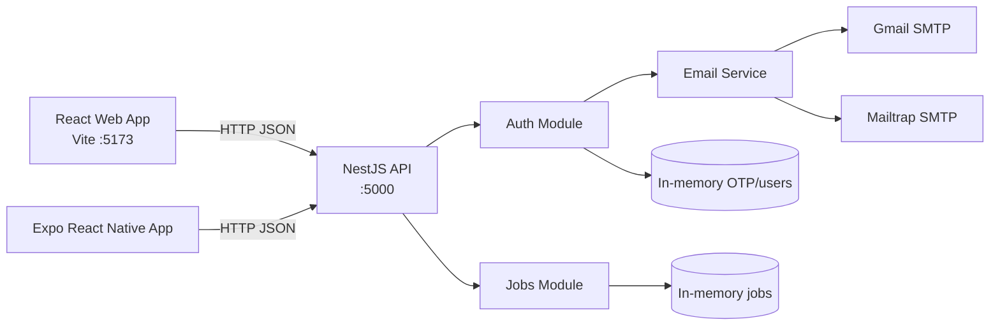
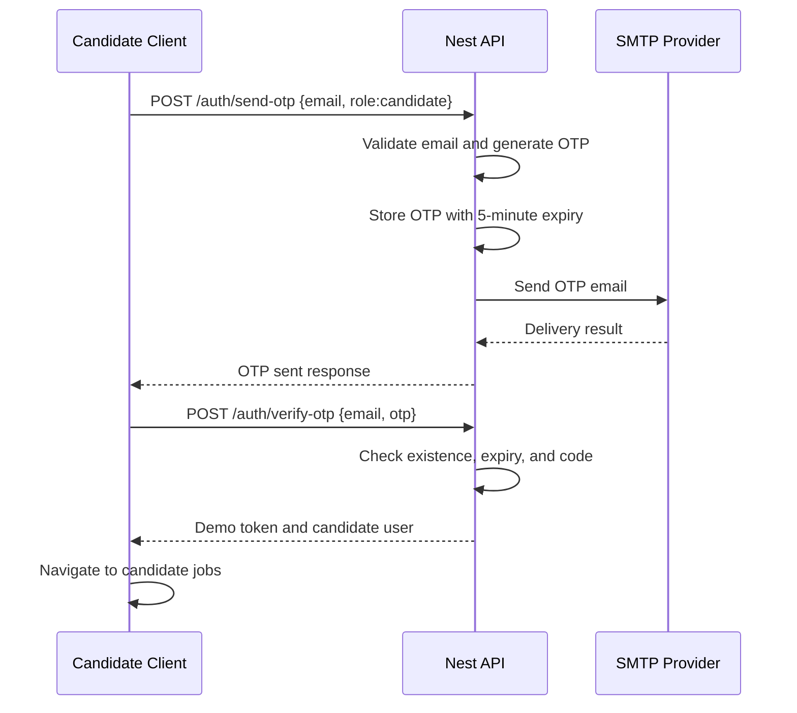

# CareerNexus: End-to-End Project Guide

This document explains the CareerNexus project from the repository root down to the runtime request flow. It describes what currently exists in the codebase, how the pieces communicate, how to run the complete system, how to test the candidate and recruiter journeys, and what must be added before production deployment.

## 1. What This Project Is

The project is a hybrid job portal with three applications:

1. A React web application for browser users.
2. A React Native application powered by Expo for Android and iOS users.
3. A NestJS REST API shared by both clients.

The current starter supports:

- Candidate and recruiter role selection.
- Email and OTP login.
- OTP resend with a cooldown.
- OTP expiry after five minutes.
- New-user OTP verification without a pre-existing user record.
- Job listing retrieval.
- Recruiter dashboard screens.
- Gmail SMTP and Mailtrap-compatible email delivery.
- Fallback OTP logging when email delivery is not configured.

The current implementation is intentionally lightweight. Jobs, known users, and OTPs are stored in memory. The returned token is a demonstration token, not a signed production JWT.

## 2. Repository Layout

```text
careernexus-job-portal/
├── backend/
│   └── api/
│       ├── src/
│       │   ├── auth/
│       │   │   ├── auth.controller.ts
│       │   │   ├── auth.module.ts
│       │   │   └── auth.service.ts
│       │   ├── email/
│       │   │   └── email.service.ts
│       │   ├── jobs/
│       │   │   ├── jobs.controller.ts
│       │   │   ├── jobs.module.ts
│       │   │   └── jobs.service.ts
│       │   │   ├── app.controller.ts
│       │   │   ├── app.module.ts
│       │   │   ├── app.service.ts
│       │   │   └── main.ts
│       │   ├── .env
│       │   ├── .env.example
│       │   ├── package.json
│       │   └── README.md
├── frontend/
│   ├── web/
│   │   ├── src/
│   │   │   ├── main.jsx
│   │   │   └── styles.css
│   │   ├── index.html
│   │   ├── package.json
│   │   └── vite.config.js
│   └── mobile/
│       ├── src/
│       │   ├── data/jobs.js
│       │   └── screens/
│       │       ├── LoginScreen.js
│       │       ├── JobsScreen.js
│       │       └── RecruiterDashboardScreen.js
│       ├── App.js
│       ├── app.json
│       └── package.json
├── docs/
│   ├── architecture/
│   │   ├── overview.md
│   │   └── system-design.md
│   ├── development/branching-strategy.md
│   ├── project-documentation.md
│   └── end-to-end-project-guide.md
│       ├── .gitignore
│       ├── CONTRIBUTING.md
│       └── README.md
```

The `dist` folders are generated build output. They are not the source of truth and should normally not be edited manually.

## 3. High-Level Architecture



The browser and mobile clients do not contain authentication business rules. They collect input, call the API, display the result, and choose the next screen from the returned role. The API owns OTP generation, expiry, resend throttling, role selection, and user construction.

## 4. Backend API

### 4.1 Backend package and scripts

File: `backend/api/package.json`

Important dependencies:

- `@nestjs/common`, `@nestjs/core`, and `@nestjs/platform-express`: NestJS application framework.
- `reflect-metadata`: required by NestJS decorators.
- `rxjs`: NestJS runtime dependency.
- `dotenv`: loads environment variables from `.env`.
- `nodemailer`: sends OTP mail through SMTP.
- TypeScript, ESLint, Prettier, and Nest CLI: development and build tooling.

Scripts:

```bash
npm run start:dev   # NestJS watch mode
npm run build       # TypeScript/Nest production build
npm run start       # Run compiled backend from dist/main.js
npm run format      # Format TypeScript source
npm run lint        # Run ESLint with auto-fix
```

### 4.2 Application bootstrap: `src/main.ts`

This is the backend entry point.

It performs four operations:

1. Loads `.env` using `dotenv.config({ override: true })`.
2. Creates the NestJS application from `AppModule`.
3. Enables CORS so the Vite browser app and Expo app can call the API.
4. Starts the server on `PORT`, defaulting to `5000`.

The API is normally available at:

```text
http://localhost:5000
```

The `override: true` option is important during local development. It prevents stale SMTP values inherited from an older terminal process from taking precedence over the current `.env` file.

### 4.3 Root module: `src/app.module.ts`

`AppModule` is the composition root for the backend. It registers:

- `AuthModule`
- `JobsModule`
- `AppController`
- `AppService`

When a new backend feature is created, its NestJS module is imported here.

### 4.4 Health controller and service

Files:

- `src/app.controller.ts`
- `src/app.service.ts`

`AppController` exposes:

```http
GET /health
```

`AppService.getHealth()` returns:

```json
{
  "status": "ok",
  "service": "careernexus-job-portal-api",
  "message": "API is running successfully."
}
```

This endpoint is the first check to run when debugging backend connectivity.

### 4.5 Auth module: `src/auth/auth.module.ts`

`AuthModule` registers:

- `AuthController` for HTTP routes.
- `AuthService` for authentication rules.
- `EmailService` for OTP delivery.

This keeps the controller thin and puts business behavior in the service.

### 4.6 Auth controller: `src/auth/auth.controller.ts`

The controller prefix is `auth`, so its routes are:

| Method | Route | Purpose |
|---|---|---|
| POST | `/auth/send-otp` | Generate and send the first OTP |
| POST | `/auth/resend-otp` | Generate and send a replacement OTP |
| POST | `/auth/verify-otp` | Validate the submitted OTP and log the user in |

Example request:

```json
{
  "email": "candidate@example.com",
  "role": "candidate"
}
```

The controller receives the JSON body and forwards it to `AuthService`. It does not generate OTPs or decide expiry itself.

### 4.7 Auth service: `src/auth/auth.service.ts`

This is the main authentication business layer.

#### Known demo users

The service currently has two in-memory known users:

- `recruiter@jobportal.com`
- `candidate@jobportal.com`

Their role is used when the OTP is verified. The service does not check a password.

#### OTP storage

OTPs are stored in a process-local `Map` using the normalized email as the key. Each entry contains:

- `otp`: six-digit generated code.
- `expiresAt`: current time plus five minutes.
- `role`: candidate or recruiter.
- `sentAt`: used for resend throttling.

This means OTPs disappear when the backend restarts and cannot be shared between multiple backend instances.

#### `sendOtp(email, role)` flow

1. Trim and lowercase the email.
2. Reject an empty value or a value without `@`.
3. Check whether an OTP was sent within the last 30 seconds.
4. Generate a six-digit code.
5. Set expiry to five minutes.
6. Normalize the role to `recruiter` or `candidate`; all other values become `candidate`.
7. Store the OTP in memory.
8. Ask `EmailService` to send it.
9. If email delivery fails, log the OTP for development fallback.
10. Return the normalized email, role, expiry duration, and whether the email is a new user.

The response shape is similar to:

```json
{
  "message": "OTP sent to your email successfully.",
  "email": "candidate@example.com",
  "expiresInSeconds": 300,
  "isNewUser": true,
  "role": "candidate"
}
```

#### `resendOtp(email, role)` flow

The resend method calls the same OTP generation logic. The 30-second cooldown prevents repeated requests from replacing the code too quickly.

#### `verifyOtp(email, otp)` flow

1. Normalize the email.
2. Find the stored OTP.
3. Reject the request if no OTP exists.
4. Delete and reject expired OTPs.
5. Compare the trimmed submitted code with the stored code.
6. Delete the OTP after successful use.
7. Build a known or new user object.
8. Return a demonstration access token and user object.

The current token is:

```text
demo-jwt-token-for-careernexus-job-portal
```

It is not a signed token and must be replaced with JWT or another secure session mechanism before production.

#### New user behavior

An email does not need to be present in the `users` object to receive an OTP. After successful verification, `buildUserForEmail()` creates a basic user from the email prefix. For example, `alex.smith@example.com` becomes a display name similar to `Alex smith`.

This demonstrates onboarding, but the user is not persisted to a database yet.

### 4.8 Email service: `src/email/email.service.ts`

`EmailService` hides the provider-specific Nodemailer setup from `AuthService`.

Supported providers:

- `gmail`
- `mailtrap`

The provider is selected with `EMAIL_PROVIDER`.

#### Gmail configuration

Gmail requires:

- SMTP host: `smtp.gmail.com`
- Port: `587`
- SMTP user: the Gmail address
- SMTP password: a Google App Password, not the normal account password
- Sender address

Two-step verification must be enabled before Google allows an App Password to be created.

#### Mailtrap configuration

Mailtrap requires credentials generated by the Mailtrap inbox. A Gmail address and Gmail App Password are not valid Mailtrap credentials.

Use the Mailtrap host, port, username, password, and sender shown in the Mailtrap SMTP integration screen.

#### Placeholder detection and fallback

The service refuses to create a transporter when credentials are missing or still contain known placeholders. In that case it logs a development fallback message containing the OTP.

If a real transporter exists but authentication fails, Nodemailer reports the SMTP error. The authentication failure must be fixed by replacing the provider credentials; it cannot be solved by changing the recipient email.

Never commit real SMTP passwords or App Passwords. If a credential is exposed, revoke it at the provider and create a replacement.

### 4.9 Jobs module

Files:

- `src/jobs/jobs.module.ts`
- `src/jobs/jobs.controller.ts`
- `src/jobs/jobs.service.ts`

`JobsModule` registers the controller and service.

`JobsController` exposes:

```http
GET /jobs
GET /jobs/featured
```

`JobsService` currently returns hard-coded arrays. A normal job record contains:

- `id`
- `title`
- `company`
- `location`
- `type`
- `salary`

The service is the replacement point for a future repository/database layer. The frontend should continue calling the controller rather than importing the service directly.

## 5. Web Application

### 5.1 Web package

File: `frontend/web/package.json`

The web app uses:

- React 18 for UI components and state.
- React DOM to mount the app.
- Vite for local development and production bundling.

Scripts:

```bash
npm run dev       # Start Vite development server
npm run build     # Create a production bundle
npm run preview   # Serve the production bundle locally
```

### 5.2 HTML entry point

`frontend/web/index.html` provides the browser document and the `root` element. Vite loads `src/main.jsx` as the module entry point.

### 5.3 Web implementation: `frontend/web/src/main.jsx`

This file contains the current web screens, API calls, and lightweight URL navigation.

#### `LoginScreen`

State maintained by the component:

- `email`: entered email address.
- `otp`: entered six-digit code.
- `otpSent`: controls whether the OTP input and submit button appear.
- `role`: recruiter or candidate.
- `error`: validation/API error text.
- `successMessage`: successful send message.
- `loadingOtp`: disables the initial send button while sending.
- `loadingVerify`: disables verification while checking.
- `resendLoading`: shows resend progress.
- `resendCooldown`: client-side countdown displayed to the user.

The web client calls:

```text
POST http://localhost:5000/auth/send-otp
POST http://localhost:5000/auth/resend-otp
POST http://localhost:5000/auth/verify-otp
```

The UI role selector changes the role and resets the demo email and OTP state. The backend remains the authority for the final role attached to the verified user.

#### `JobsScreen`

The jobs screen:

- Receives the jobs array as a prop.
- Displays title, company, type, location, and salary.
- Shows a recruiter dashboard button only for recruiter users.
- Provides a back button to the login screen.

#### `RecruiterDashboardScreen`

The dashboard is currently presentation-only. It displays static values for:

- Open positions.
- Interviews.
- Shortlisted candidates.
- Recent applicants.

No dashboard data is fetched from the backend yet.

#### `App`

`App` performs the web-level routing and data loading.

Navigation is implemented with URL hashes and browser history:

- `#login`
- `#jobs`
- `#candidate-jobs`
- `#dashboard`

On startup, `App` requests `GET http://localhost:5000/jobs`. If the API is unavailable, it uses the local `fallbackJobs` array so the page can still render.

After OTP verification:

- Candidate users go to `candidate-jobs`.
- Recruiter users go to `jobs`.

The current user is held in React state. Refreshing the browser loses the user session because there is no persistent token storage yet.

### 5.4 Web styling: `frontend/web/src/styles.css`

The stylesheet defines:

- Global colors and typography.
- Auth card and role selector.
- Buttons, input fields, errors, and success messages.
- Job cards and metadata pills.
- Recruiter dashboard statistics and applicant panel.
- A mobile breakpoint for the top bar and dashboard grid.

The stylesheet is imported by `main.jsx`, so Vite includes it in the web bundle.

### 5.5 Vite configuration

`frontend/web/vite.config.js` enables the React plugin and runs the development server on port `5173`.

The web app therefore normally runs at:

```text
http://localhost:5173
```

## 6. Mobile Application

### 6.1 Mobile package

File: `frontend/mobile/package.json`

The mobile app uses:

- Expo SDK 51.
- React Native.
- React Navigation native stack.
- Safe-area and native-screen support packages.

Scripts:

```bash
npm start       # Start Expo Metro Bundler
npm run android # Start Expo and open Android
npm run ios     # Start Expo and open iOS
npm run web     # Run the Expo web target
```

### 6.2 Expo configuration

`frontend/mobile/app.json` defines the application name, slug, version, portrait orientation, light interface mode, and asset bundling pattern.

### 6.3 Navigation root: `frontend/mobile/App.js`

`App.js` creates a native stack with these routes:

- `Login`
- `Jobs`
- `CandidateJobs`
- `RecruiterDashboard`

The login screen is the initial route. The two jobs routes reuse the same `JobsScreen` component but receive different user roles.

### 6.4 Mobile API base URL

The mobile screens define:

```js
Platform.OS === 'android'
  ? 'http://10.0.2.2:5000'
  : 'http://localhost:5000'
```

`10.0.2.2` is the Android emulator alias for the host machine's localhost. A physical phone cannot use `10.0.2.2`; it must use the computer's LAN IP address, for example `http://192.168.1.20:5000`, and the backend must listen on an accessible interface.

### 6.5 Mobile login: `src/screens/LoginScreen.js`

The mobile login screen mirrors the web OTP flow:

1. Select recruiter or candidate.
2. Enter an email.
3. Send OTP.
4. Wait for the API response.
5. Enter the OTP.
6. Submit for verification.
7. Navigate based on `data.user.role`.

It also supports resend OTP with a 30-second local countdown. Alerts display validation, success, and failure messages.

### 6.6 Mobile jobs: `src/screens/JobsScreen.js`

The screen:

- Starts with local fallback jobs.
- Calls `GET /jobs` on mount.
- Replaces fallback data if the API returns a non-empty array.
- Reads the user role from navigation parameters.
- Shows the recruiter dashboard CTA only to recruiters.
- Allows recruiter job cards to open the dashboard.
- Keeps candidates in the candidate jobs experience.

### 6.7 Mobile recruiter dashboard

`RecruiterDashboardScreen.js` displays static recruiter statistics and recent applicants in a scrollable view. It is a UI placeholder for future recruiter APIs such as job creation, applicant lists, interview scheduling, and status updates.

### 6.8 Mobile local data

`src/data/jobs.js` contains a separate static jobs array. The current `JobsScreen` also contains its own fallback array, so this data file is not currently the active source used by the screen. It can be consolidated when the data layer is refactored.

## 7. Complete Runtime Flows

### 7.1 Candidate login flow



The same flow works for a new email. The difference is that `isNewUser` is true and a basic user object is built after verification.

### 7.2 Recruiter login flow

The recruiter flow is identical until verification. The selected role is `recruiter`, and the client navigates to the recruiter jobs route. From there the recruiter can open the dashboard screen.

For the known demo recruiter, the email is `recruiter@jobportal.com`. For a new recruiter email, the requested role is used to construct the new user.

### 7.3 Job loading flow

1. Web `App` or mobile `JobsScreen` starts with fallback data.
2. The client calls `GET /jobs`.
3. If the API returns jobs, the client replaces the fallback array.
4. If the request fails, the fallback array remains visible.

This fallback is useful during UI development but should not hide production API failures indefinitely.

## 8. Environment Configuration

The backend reads `backend/api/.env`. The example file is `backend/api/.env.example`.

Example shape:

```env
EMAIL_PROVIDER=gmail
SMTP_HOST=smtp.gmail.com
SMTP_PORT=587
SMTP_SECURE=false
SMTP_USER=your-email@gmail.com
SMTP_PASS=your-google-app-password
SMTP_FROM=your-email@gmail.com

# Or use Mailtrap instead:
MAILTRAP_HOST=sandbox.smtp.mailtrap.io
MAILTRAP_PORT=2525
MAILTRAP_USER=your-mailtrap-user
MAILTRAP_PASS=your-mailtrap-password
MAILTRAP_FROM=sender@example.com

PORT=5000
```

Use exactly one active provider:

- Gmail: `EMAIL_PROVIDER=gmail` and valid Gmail SMTP values.
- Mailtrap: `EMAIL_PROVIDER=mailtrap` and valid Mailtrap SMTP values.

Never paste real secrets into documentation, source files, commits, chat, or screenshots. `.gitignore` excludes `.env`, but secret rotation is still required if a credential has been exposed.

## 9. End-to-End Local Setup

### Prerequisites

Install:

- Node.js compatible with the project dependencies.
- npm.
- Git.
- Android Studio and an emulator for Android testing, or Expo Go on a physical device.
- A Gmail account with a Google App Password or a Mailtrap account for SMTP testing.

### Step 1: Install backend dependencies

```powershell
cd D:\job-portal\backend\api
npm install
```

Create or update `.env` using `.env.example`. Put real provider credentials in `.env` only.

### Step 2: Start the backend

```powershell
cd D:\job-portal\backend\api
npm run start:dev
```

Expected output:

```text
Application is running on: http://localhost:5000
```

In a second terminal, check health:

```powershell
Invoke-RestMethod http://localhost:5000/health
```

### Step 3: Install and start the web client

```powershell
cd D:\job-portal\frontend\web
npm install
npm run dev
```

Open:

```text
http://localhost:5173
```

### Step 4: Install and start the mobile client

```powershell
cd D:\job-portal\frontend\mobile
npm install
npx expo start
```

Then choose one:

- Press `a` for an Android emulator.
- Scan the QR code with Expo Go on a physical device.
- Press `w` for the Expo web target.

### Step 5: Test the API independently

Health:

```powershell
Invoke-RestMethod http://localhost:5000/health
```

Jobs:

```powershell
Invoke-RestMethod http://localhost:5000/jobs
```

Send OTP:

```powershell
$body = @{ email = 'candidate@example.com'; role = 'candidate' } | ConvertTo-Json
Invoke-RestMethod http://localhost:5000/auth/send-otp -Method Post -ContentType 'application/json' -Body $body
```

If SMTP is not configured, read the generated OTP in the backend terminal. If SMTP is configured, read the OTP from the configured inbox.

Verify OTP:

```powershell
$body = @{ email = 'candidate@example.com'; otp = '123456' } | ConvertTo-Json
Invoke-RestMethod http://localhost:5000/auth/verify-otp -Method Post -ContentType 'application/json' -Body $body
```

Replace `123456` with the actual code.

## 10. Recommended Test Checklist

### Backend

- `npm run build` succeeds.
- `GET /health` returns status `ok`.
- `GET /jobs` returns an array.
- Invalid email is rejected.
- OTP response contains a five-minute expiry.
- Repeated send within 30 seconds is rejected.
- Correct OTP verifies successfully.
- Incorrect OTP is rejected.
- Expired OTP is rejected.
- Used OTP cannot be reused.
- Resend creates a replacement OTP after the cooldown.
- New email can verify without a pre-existing user record.

### Web

- Vite starts on port 5173.
- Candidate role reaches candidate jobs.
- Recruiter role reaches jobs and dashboard.
- OTP input appears only after a successful send response.
- Resend button shows the cooldown.
- Browser back updates the hash-based screen.
- Jobs still render when the API is unavailable because fallback data is present.

### Mobile

- Expo Metro starts without bundling errors.
- Android emulator uses `10.0.2.2` for the API.
- Physical devices use the development machine's LAN IP.
- Candidate and recruiter navigation routes correctly.
- Recruiter dashboard CTA is hidden for candidates.
- Jobs API fallback renders when the backend is unavailable.

## 11. Common Problems and Fixes

### Port 5000 is already in use

Find the process:

```powershell
Get-NetTCPConnection -LocalPort 5000
```

Stop the owning process only if it is an old backend instance:

```powershell
Stop-Process -Id <PID> -Force
```

Then start the backend once. Multiple `npm run start:dev` processes cause `EADDRINUSE`.

### Gmail reports `535 Invalid credentials`

Use a Google App Password, not the normal Gmail password. Confirm:

- 2-Step Verification is enabled.
- The App Password belongs to the same Gmail account in `SMTP_USER`.
- The App Password has no spaces after copying.
- The credential has not been revoked.
- `EMAIL_PROVIDER=gmail`.

If the credential was exposed, revoke it and create a replacement.

### Mailtrap reports `535 Invalid credentials`

Do not use Gmail credentials in the Mailtrap fields. Copy the Mailtrap username and password from the Mailtrap SMTP integration settings and set `EMAIL_PROVIDER=mailtrap`.

### Mobile cannot reach the backend

- Android emulator: use `http://10.0.2.2:5000`.
- iOS simulator: use `http://localhost:5000`.
- Physical phone: use `http://<computer-LAN-IP>:5000`.
- Confirm the phone and computer are on the same network.
- Confirm Windows Firewall allows the backend port.

### Expo reports a JavaScript syntax error

Stop the bundler, fix the source error, and restart with:

```powershell
npx expo start -c
```

The `-c` option clears Metro's cache.

### The web app shows fallback jobs

The backend request failed or returned no jobs. Check the API health endpoint, browser network errors, CORS, and whether the backend is running on port 5000.

## 12. Git and Branching Workflow

The repository uses a GitFlow-inspired approach:

- `main`: stable production code.
- `develop`: integration branch.
- `feature/*`: isolated feature work.

Typical workflow:

```bash
git checkout develop
git pull origin develop
git checkout -b feature/auth-improvements
# make and test changes
git add .
git commit -m "Improve OTP authentication"
git push -u origin feature/auth-improvements
```

Open a pull request into `develop`. After review and checks pass, merge it. Release `develop` to protected `main` through another reviewed pull request.

`main` should require pull requests, reviewer approval, passing checks, and no direct pushes.

## 13. Current Limitations

The project is a working starter, not a complete production portal. The important limitations are:

1. Users are stored in a constant in `AuthService`; new users are not persisted.
2. OTPs are stored in one Node process's memory.
3. OTP generation uses `Math.random()` and should use a cryptographically secure generator.
4. The access token is a fixed demonstration string.
5. No JWT guard protects jobs or recruiter routes.
6. CORS is enabled broadly.
7. There are no request DTO validation pipes or rate limiting middleware.
8. Email delivery errors are caught and the OTP is logged, which is acceptable only for local development.
9. Jobs are hard-coded in the backend.
10. The recruiter dashboard is static and has no recruiter API.
11. There is no application submission, candidate profile, recruiter job creation, or admin feature.
12. The web and mobile clients duplicate API URL and fallback-job logic.
13. There are no automated unit, integration, or end-to-end tests yet.
14. There is no database migration or deployment configuration.

## 14. Production Upgrade Plan

A practical next sequence is:

### Phase 1: Secure the existing flow

- Add `class-validator` DTOs and global validation.
- Replace `Math.random()` with `crypto.randomInt()`.
- Store OTP hashes rather than plain OTP values.
- Add attempt limits and IP/email rate limits.
- Stop returning success when real email delivery fails.
- Add structured logging without secrets.

### Phase 2: Add persistence

- Add PostgreSQL.
- Create users, roles, OTP challenges, jobs, applications, and recruiter profile tables.
- Use Prisma or TypeORM migrations.
- Store new verified users and their selected role.
- Move OTP storage to PostgreSQL or Redis.

### Phase 3: Add authorization

- Issue signed short-lived access tokens and refresh tokens.
- Add NestJS authentication guards.
- Add role guards for candidate and recruiter routes.
- Store sessions securely in the web and mobile clients.

### Phase 4: Build real product features

- Recruiter create/edit/publish job APIs.
- Candidate profile and resume upload.
- Job search and filtering.
- Applications and application status transitions.
- Recruiter applicant lists.
- Notifications and audit history.

### Phase 5: Production operations

- Add unit, integration, and browser/device tests.
- Add CI checks for build, lint, and tests.
- Containerize the API.
- Configure secrets through the deployment platform.
- Add HTTPS, monitoring, backups, and error tracking.
- Deploy web, API, database, and mail provider separately.

## 15. Definition of Done for the Current Starter

The current starter can be considered locally complete when:

- Backend dependencies are installed.
- `.env` contains valid provider-specific SMTP settings or local fallback is intentionally enabled.
- `npm run build` passes in `backend/api`.
- `npm run start:dev` starts one API instance on port 5000.
- `GET /health` succeeds.
- Web `npm run build` succeeds.
- Expo Android export or Metro bundling succeeds.
- Candidate OTP login reaches candidate jobs.
- Recruiter OTP login reaches recruiter jobs and dashboard.
- Resend cooldown and five-minute expiry behave as expected.

This is the full current path from source files to a running web and mobile job portal backed by one NestJS API.
